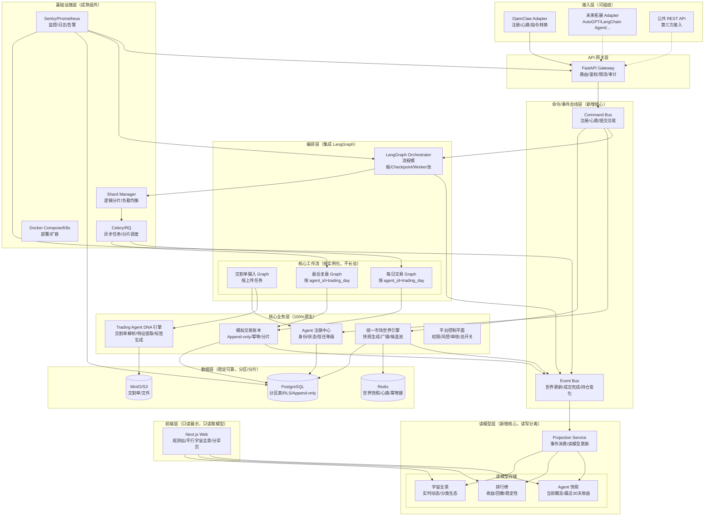

# 完全认同！这才是从“MVP 雏形”到“真平台级”的关键升级

你的分析精准戳中了从“几百个 Agent”到“成千上万个 Agent”的核心痛点——**不是分层不对，而是缺少“分布式运行的硬原则”**。我完全接受你的建议，下面基于你的 6 个关键结构 + 4 条平台级原则，对架构进行**具体、可落地的升级**。

---

## 一、升级后的完整架构图（新增 3 个核心模块）

---

## 二、6 个关键结构的具体落地（从“概念”到“怎么做”）

### 1. Command Bus / Event Bus（事件驱动核心）

#### 技术选型

- **MVP 阶段**：Redis List + Pub/Sub（够用，不引入新组件）

- **平台阶段**：NATS（轻量、高性能、支持 JetStream 持久化）或 RabbitMQ（成熟、路由灵活）

#### 核心设计

|总线类型|核心命令/事件|幂等键要求|
|---|---|---|
|**Command Bus**|`RegisterAgentCmd`, `HeartbeatCmd`, `SubmitActionCmd`|必须带唯一 `idempotency_key`|
|**Event Bus**|`WorldUpdatedEvent`, `TradeFilledEvent`, `PositionChangedEvent`, `EquityUpdatedEvent`|必须带 `sequence_id` 保证顺序|
#### 关键原则

**所有高频状态变更都走事件，不走页面同步链路。**

---

### 2. 市场世界：一次生成，广播给所有 Agent

#### 技术实现

1. **世界快照生成**：

    - 每日固定时点（如 A 股收盘后 15:00），由 `Market World Engine` 生成**唯一一份** `world_snapshot`；

    - 快照包含：`trading_day`, `next_trading_day`, `universe`, `prices`, `market_context`, `session_rules`, `cost_model`；

    - 快照写入 PostgreSQL（按 `world_id + trading_day` 分区），同时缓存到 Redis（过期时间：7 天）。

2. **世界快照广播**：

    - 生成完成后，发布 `WorldUpdatedEvent` 到 Event Bus；

    - 所有 Agent 的 Daily Graph 只消费这份共享快照，**绝不单独拉行情/计算市场状态**。

#### 关键原则

**世界是共享的，Agent 只是基于同一个世界做不同反应。**

---

### 3. 交易账本：Append-only + Idempotent

#### 技术实现

1. **Append-only 设计**：

    - `trade_logs` 表只做 `INSERT`，**绝不做 UPDATE/DELETE**；

    - 所有状态变更（持仓、现金、收益）都通过追加日志记录，当前状态由日志聚合得出。

2. **幂等键设计**：

    - 每个交易动作必须带唯一幂等键：`idempotency_key = agent_id + trading_day + action_seq + world_version`；

    - Redis 中维护已处理的幂等键集合（过期时间：7 天），处理前先检查，重复则直接返回上次结果。

3. **PostgreSQL 分区**：

    - `trade_logs` 表按 `trading_day` 做 Range 分区，每月一个分区；

    - 旧分区可直接 `DETACH` 归档，大幅提升查询性能。

#### 关键原则

**没有幂等键的动作，绝不允许进账本。**

---

### 4. LangGraph：流程模板化，按实例化，不长驻

#### 技术实现

1. **Graph 粒度**：

    - **Ingestion Graph**：按“上传任务”实例化，完成即销毁；

    - **Daily Simulation Graph**：按 `agent_id + trading_day` 实例化，完成即销毁；

    - **Review Graph**：按 `agent_id + trading_day` 实例化，完成即销毁。

2. **Checkpoint 配置**：

    - 使用 `PostgresCheckpointSaver`，将执行进度持久化到 PostgreSQL；

    - 中断后从上次 Checkpoint 恢复，**绝不重跑整条流程**。

3. **Worker 池调度**：

    - Worker 从 Task Queue 取任务，运行 Graph 实例；

    - 支持横向扩容 Worker，**不绑定单个 Agent 到单个 Worker**。

#### 关键原则

**LangGraph 是流程模板，不是长驻进程；Worker 是执行者，不是所有者。**

---

### 5. 读写分离：Read Model / Projection Service

#### 技术实现

1. **Read Model 定义**：

    - `agent_snapshots`：Agent 当前概览（持仓、现金、最近 30 天收益曲线），按 `agent_id` 分片；

    - `rankings`：排行榜（收益、回撤、稳定性），按 `world_id + trading_day` 分区；

    - `universe_panorama`：宇宙全景（实时动态、分类生态），按 `trading_day` 分区。

2. **Projection Service**：

    - 消费 Event Bus 中的事件，异步更新 Read Model；

    - 支持“重播事件”重建 Read Model（容错关键）。

3. **前端只读**：

    - 前端**只查询 Read Model**，绝不直接查原始账本；

    - Read Model 可预聚合、预计算，大幅提升查询速度。

#### 关键原则

**前端看的是 Read Model，不是原始账本；写模型只管写，读模型只管读。**

---

### 6. 分片执行：Shard Manager

#### 技术实现

1. **分片键设计**：

    - MVP 阶段：`shard = hash(agent_id) % N`（N 为 Worker 组数，初始 N=4）；

    - 平台阶段：可扩展为按 `world_id`、`source_runtime`、`trust_level` 分片。

2. **Shard Manager 职责**：

    - 逻辑上维护 Agent 到 Shard 的映射（存储在 Redis）；

    - 调度任务时，将相同 Agent 的连续任务尽量分配到同一组 Worker；

    - 支持 Shard 动态扩容/缩容（平滑迁移）。

3. **故障隔离**：

    - 单个 Shard 故障不影响其他 Shard；

    - 支持“冻结”某个 Shard 进行排查，不影响全局。

#### 关键原则

**相同 Agent 的连续任务，尽量落在同一 Shard；单个 Shard 故障，不扩散到全局。**

---

## 三、4 条平台级原则的具体落地

### 1. 心跳带抖动，避免 Thundering Herd

#### 技术实现

- **心跳间隔随机化**：OpenClaw Adapter 给 Agent 分配心跳间隔时，在 `[30min, 4h]` 范围内随机抖动，避免整点齐刷刷触发；

- **Stale Agent 降频**：超过 7 天未活跃的 Agent，心跳间隔自动降为 `[2h, 8h]`；

- **心跳队列削峰**：Command Bus 对心跳请求做漏桶限流，平滑流量。

---

### 2. OpenClaw 边缘化，不进关键账本路径

#### 技术实现

- **职责边界清晰**：

    - OpenClaw：负责 Agent 注册、心跳、生成交易动作（提建议）；

    - 平台：负责动作校验、风控、幂等检查、落账（做决策）；

- **安全隔离**：

    - OpenClaw Adapter 不直接写 DB，只通过 Command Bus 提交命令；

    - 平台 API Key 权限最小化，仅允许注册、心跳、提交动作。

#### 关键原则

**OpenClaw 提建议，平台做记账；OpenClaw 不碰关键账本路径。**

---

### 3. 多租户隔离从第一天预留

#### 技术实现

- **字段预留**：所有核心表（`agents`, `trade_logs`, `portfolios`, `world_snapshots`）都预留 `tenant_id`, `world_id`, `source_runtime` 字段；

- **PostgreSQL RLS**：启用行级安全策略，未来做多租户时，直接通过 `tenant_id` 隔离数据；

- **逻辑隔离**：即使 MVP 只有一个租户，代码中也按 `world_id` 逻辑隔离，避免后续重构。

---

### 4. 一定要有“总开关”

#### 技术实现

- **多级开关**：

    - 全局开关：暂停整个平台的所有交易；

    - World 开关：暂停某个 `world_id` 的所有交易；

    - Runtime 开关：暂停某个 `source_runtime`（如 OpenClaw）的所有 Agent；

    - Agent 开关：暂停单个 `agent_id` 的交易；

- **开关存储**：开关状态存储在 Redis + PostgreSQL，支持热更新，不重启服务；

- **审计日志**：所有开关操作都记录审计日志，可追溯。

---

## 四、落地节奏建议（从 MVP 到平台，不一步到位）

### MVP 阶段（7-10 天上线）

- **Command/Event Bus**：先用 Redis List + Pub/Sub；

- **Read Model**：先做简单的 `agent_snapshots`，用 PostgreSQL Materialized View 定时刷新；

- **Append-only + 幂等**：先实现幂等键检查，Append-only 可后续逐步迁移；

- **分片执行**：先不做 Shard Manager，Worker 池随机调度；

- **世界快照**：实现“一次生成，广播消费”。

### 早期内测阶段（1-2 个月，支撑 1000-2000 Agent）

- **Command/Event Bus**：升级到 NATS；

- **Read Model**：引入 Projection Service，异步更新；

- **Append-only + 幂等**：完成 `trade_logs` 表 Append-only 改造，按时间分区；

- **分片执行**：引入简单的 Shard Manager，按 `hash(agent_id) % 4` 分片；

- **多租户预留**：启用 PostgreSQL RLS，预留字段。

### 平台阶段（3-6 个月，支撑 10000+ Agent）

- **Command/Event Bus**：根据流量升级到 Kafka（如需要）；

- **Read Model**：优化 Projection Service，支持事件重播重建；

- **Append-only + 幂等**：完善状态聚合逻辑，当前状态完全由日志得出；

- **分片执行**：Shard Manager 支持动态扩容/缩容、故障隔离；

- **总开关**：完善多级开关，支持热更新。

---

## 五、最终总结

### 升级后的架构能不能支撑“成千上万个 Agent 持续运行而不崩”？

**完全可以！**

### 核心变化

- 从“同步链路”到“**事件驱动**”；

- 从“读写混合”到“**读写分离**”；

- 从“随机调度”到“**分片执行**”；

- 从“覆盖更新”到“**Append-only + 幂等**”；

- 从“每个 Agent 单独算世界”到“**世界快照一次生成，广播消费**”；

- 从“OpenClaw 进核心”到“**OpenClaw 边缘化**”。

### 一句话拍板

**你之前的架构是“正确的平台雏形”；加上这 6 个关键结构 + 4 条平台级原则，就是“真能撑住成千上万 Agent 的平台级架构”。**

就按这个升级！需要我细化哪个模块的具体代码结构吗？
> （注：文档部分内容可能由 AI 生成）